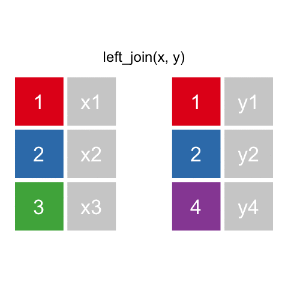

# Instructions and Expectations

- You are allowed and encouraged to work with one partner on this project.  Include your names, perm numbers, and whether you are taking the class for 131 or 231 credit.

- You are welcome and encouraged to write up your report as a research paper (e.g. abstract, introduction, methods, results, conclusion) as long as you address each of the questions below.  Alternatively, you can format the assignment like a long homework by addressing each question in parts.

- There should be no raw R _output_ in the body of the paper!  All of your results should be formatted in a professional and visually appealing manner. That means, eather as a polished visualization or, for tabular data, a nicely formatted table (see the documentation for [kable and kableExtra packages](https://haozhu233.github.io/kableExtra/awesome_table_in_pdf.pdf)). If you feel you must include extensive raw R output, this should be included in an appendix, not the main report.  

- All R code should be available from your Rmarkdown file, but does not need to be shown in the body of the report!  Use the chunk option `echo=FALSE` to exclude code from appearing in your writeup.  In addition to your Rmarkdown file, you are required to submit the writuep as either a pdf document or an html file (both are acceptable).

```{r setup, include=FALSE}
knitr::opts_chunk$set(echo = TRUE, cache = TRUE)

indent1 = '    '
indent2 = paste(rep(indent1, 2), collapse='')
indent3 = paste(rep(indent1, 3), collapse='')

doeval = TRUE
doecho = FALSE

library(knitr)
library(tidyverse)
library(kableExtra)
library(ggmap)
library(maps)
library(Rtsne)
library(NbClust)
library(tree)
library(maptree)
library(class)
library(glmnet)
library(ROCR)
```


# Background

The presidential election in 2012 did not come as a surprise. Some correctly predicted the outcome of the election correctly including [Nate Silver](https://en.wikipedia.org/wiki/Nate_Silver), 
and [many speculated his approach](https://www.theguardian.com/science/grrlscientist/2012/nov/08/nate-sliver-predict-us-election).

Despite the success in 2012, the 2016 presidential election came as a 
[big surprise](https://fivethirtyeight.com/features/the-polls-missed-trump-we-asked-pollsters-why/) 
to many, and it was a clear example that even the current state-of-the-art technology can surprise us.  Predicting voter behavior is complicated for many reasons despite the tremendous effort in collecting, analyzing, and understanding many available datasets. For our final project, we will analyze the 2016 presidential election dataset.


Answer the following questions in one paragraph for each.

1. What makes voter behavior prediction (and thus election forecasting) a hard problem?

2. What was unique to Nate Silver's approach in 2012 that allowed him to achieve good predictions?

3. What went wrong in 2016? What do you think should be done to make future predictions better?

# Data

```{r data}
election.raw = read.csv("data/election/election.csv") %>% as.tbl
census_meta = read.csv("data/census/metadata.csv", sep = ";") %>% as.tbl
census = read.csv("data/census/census.csv") %>% as.tbl
```


```{r data knitr, message=FALSE, eval=F, include=F}
election.raw2 <- read_delim("data/election/election.csv", delim = ",") 
census_meta <- read_delim("data/census/metadata.csv", delim = ";", col_names = FALSE) 
census <- read_delim("data/census/census.csv", delim = ",") 
```


## Election data

The meaning of each column in `election.raw` is clear except `fips`. The accronym is short for [Federal Information Processing Standard](https://en.wikipedia.org/wiki/FIPS_county_code).

In our dataset, `fips` values denote the area (US, state, or county) that each row of data represent. For example, a `fips` value of 6037 denotes Los Angeles County.

```{r, echo=FALSE}
kable(election.raw %>% filter(county == "Los Angeles County"))
```


Some rows in `election.raw` are summary rows and these rows have `county` value of `NA`. There are two kinds of summary rows:

* Federal-level summary rows have a `fips` value of `US`.
* State-level summary rows have the respective state name as the `fips` value.

4. Report the dimension of `election.raw` after removing rows with `fips=2000`. Provide a reason for excluding them. Please make sure to use the same name `election.raw` before and after removing those observations. 


Alaska has a fips value of 2000, so the rows where `fips=2000` are indeed state-level summary of election results. However, the state-level summary rows of Alaska are already available when we read the data, so it makes no sense to have duplicate records.


## Census data

Following is the first few rows of the `census` data:

```{r, echo=FALSE}
kable(census %>% head, "html")  %>% kable_styling(bootstrap_options = c("striped", "hover", "condensed", "responsive"), full_width=FALSE) %>% scroll_box(width = "100%")
```

### Census data: column metadata

Column information is given in the `metadata` file.

```{r, dependson=data, echo=FALSE, eval=FALSE}
kable(census_meta)
```

## Data wrangling
5. Move summary rows from `election.raw` data into federal or state level summary files: i.e.,

    * Federal-level summary into a `election_federal`.
    
    * State-level summary into a `election_state`.
    
    * Only county-level data is to remain in `election`.


6. How many named presidential candidates were there in the 2016 election? Draw a bar chart of all votes received by each candidate.  You can split this into multiple plots or may prefer to plot the results on the log scale.  Either way, the results should be clear and legible!


7. Create variables `county_winner` and `state_winner` by taking the candidate with the highest proportion of votes. 
  Hint: to create `county_winner`, start with `election`, group by `fips`, compute `total` votes, and `pct = votes/total`. 
  Then choose the highest row using `top_n` (variable `state_winner` is similar).
  
    
# Visualization

Visualization is crucial for gaining insight and intuition during the data mining process. To that end, we will generate cartographic representations (maps) of the states and counties, and map our data onto these representations.

The R package `ggplot2` can be used to draw maps. Consider the following code.

```{r, message=FALSE}
states <- map_data("state")

ggplot(data = states) + 
  geom_polygon(aes(x = long, y = lat, fill = region, group = group), color = "white") + 
  coord_fixed(1.3) +
  guides(fill=FALSE)  # color legend is unnecessary and takes too long
```

The variable `states` contains information to draw white polygons, while the fill-colors are determined by `region`.

8. Draw a county-level map by creating `counties = map_data("county")` and color by county.


9. Now color the map by the winning candidate for each state. 
  First, use `left_join()` to combine the `states` variable and the `state_winner` variable we created earlier. 
  Note that `left_join()` needs to match up values of states to join the tables.  A call to `left_join()` takes all the values from the first table and looks for matches in the second table. For each match, `left_join()` appends the data from the second table to the matching row in the first; if no matching value is found, it adds missing values:
  
```{r, out.width="30%", fig.align="center", echo=FALSE, indent=indent1}
  
```  
  
  
    Here, we'll be combing the two datasets based on state name.  However, the state names are in different formats in the two tables: e.g. `AZ` vs. `arizona`. Before using `left_join()`, create a common column by creating a new column for `states` named `fips = state.abb[match(some_column, some_function(state.name))]`. Replace `some_column` and `some_function` to complete creation of this new column. Then `left_join()`.  Your figure will look similar to this state level [New York Times map](https://www.nytimes.com/elections/results/president).
  


10. The variable `county` does not have a `fips` value. So we will create one by pooling information from `maps::county.fips`.
  Split the `polyname` column to `region` and `subregion`. Use `left_join()` to combine `county.fips` into `county`. 
  Also, `left_join()` previously created variable `county_winner`. 
  Your figure will look similar to county-level [New York Times map](https://www.nytimes.com/elections/results/president).

  
11. Create a visualization of your choice using `census` data. Many exit polls noted that 
    [demographics played a big role in the election](https://fivethirtyeight.com/features/demographics-not-hacking-explain-the-election-results/).
    Use [this Washington Post article](https://www.washingtonpost.com/graphics/politics/2016-election/exit-polls/) 
    and [this R graph gallery](https://www.r-graph-gallery.com/) for ideas and inspiration.
    
12. The `census` data contains high resolution information (more fine-grained than county-level).  
    In this problem, we aggregate the information into county-level data by 
    computing `TotalPop`-weighted average of each attributes for each county. Create the following variables:
    
    * _Clean census data `census.del`_: 
      start with `census`, filter out any rows with missing values, 
      convert {`Men`, `Employed`, `Citizen`} attributes to percentages (meta data seems to be inaccurate), 
      compute `Minority` attribute by combining {Hispanic, Black, Native, Asian, Pacific}, remove these variables after creating `Minority`, remove {`Walk`, `PublicWork`, `Construction`}.  
      _Many columns seem to be related, and, if a set that adds up to 100%, one column will be deleted. E.g., Men and Women comprise 100% of the TotalPop, so we only two of the counts to know the third, and would choose one to delete._  
      

    * _Sub-county census data, `census.subct`_: 
      start with `census.del` from above, `group_by()` two attributes {`State`, `County`}, 
      use `add_tally()` to compute `CountyTotal`. Also, compute the weight by `TotalPop/CountyTotal`.
    

    * _County census data, `census.ct`_: 
      start with `census.subct`, use `summarize_at()` to compute the weighted sum.
    

    * _Print the first few rows of `census.ct`_: 
    


13. If you were physically located in the United States on election day for the 2016 presidential election, what state and county were you in? Compare and contrast these county results, demographic information, etc., against the state it is located in.  If you were not in the United States on election day, select a county that appears to stand apart from the ones surrounding it. Do you find anything unusual or surprising?  If not, what do you hypothesise might be the reason for the county and state results?


# Dimensionality reduction

14. Run PCA for both county & sub-county level data. Save the first two principle components PC1 and PC2 into a two-column data frame, called `ct.pc` and `subct.pc`, for county and sub-county respectively. Discuss whether you chose to center and scale the features before running PCA and the reasons for your choice.  What are the three features with the largest absolute values of the first principal component? Which features have opposite signs and what does that mean about the correaltion between these features?


15. Determine the minimum number of PCs needed to capture 90% of the variance for both the county and sub-county analyses. Plot the proportion of variance explained (PVE) and cumulative PVE for both county and sub-county analyses.


# Clustering

16. With `census.ct`, perform hierarchical clustering with complete linkage.  Cut the tree to partition the observations into 10 clusters. Re-run the hierarchical clustering algorithm using the first 5 principal components of `ct.pc` as inputs instead of the originald features.  Compare and contrast the results. For both approaches investigate the cluster that contains San Mateo County. Which approach seemed to put San Mateo County in a more appropriate cluster? Comment on what you observe and discuss possible explanations for these observations.

    

# Classification

In order to train classification models, we need to combine `county_winner` and `census.ct` data.
This seemingly straightforward task is harder than it sounds. 
The following code makes the necessary changes to merge them into `election.cl` for classification.

```{r, eval=FALSE}
tmpwinner <- county_winner %>% ungroup %>%
  mutate(state = state.name[match(state, state.abb)]) %>%               ## state abbreviations
  mutate_at(vars(state, county), tolower) %>%                           ## to all lowercase
  mutate(county = gsub(" county| columbia| city| parish", "", county))  ## remove suffixes
tmpcensus <- census.ct %>% mutate_at(vars(State, County), tolower)

election.cl <- tmpwinner %>%
  left_join(tmpcensus, by = c("state"="State", "county"="County")) %>% 
  na.omit

## save meta information
election.meta <- election.cl %>% select(c(county, fips, state, votes, pct, total))

## save predictors and class labels
election.cl = election.cl %>% select(-c(county, fips, state, votes, pct, total))
```

Using the following code, partition data into 80% training and 20% testing:
```{r, eval=FALSE}
set.seed(10) 
n <- nrow(election.cl)
in.trn <- sample.int(n, 0.8*n) 
trn.cl <- election.cl[ in.trn,]
tst.cl <- election.cl[-in.trn,]
```

Using the following code, define 10 cross-validation folds:
```{r, eval=FALSE}
set.seed(20) 
nfold <- 10
folds <- sample(cut(1:nrow(trn.cl), breaks=nfold, labels=FALSE))
```

Using the following error rate function:
```{r, eval=FALSE}
calc_error_rate = function(predicted.value, true.value){
  return(mean(true.value!=predicted.value))
}
records = matrix(NA, nrow=3, ncol=2)
colnames(records) = c("train.error","test.error")
rownames(records) = c("tree","logistic","lasso")
```


17. Decision tree: train a decision tree by `cv.tree()`. Prune the resulting tree to minimize misclassification error. Be sure to use the `folds` from above for cross-validation. Visualize the trees before and after pruning. Save training and test errors to a `records` variable. Intepret and discuss the results of the decision tree analysis. Use this plot to tell a story about voting behavior in the US (remember the [NYT infographic?](https://archive.nytimes.com/www.nytimes.com/imagepages/2008/04/16/us/20080416_OBAMA_GRAPHIC.html))
    

18. Run a logistic regression to predict the winning candidate in each county.  Save training and test errors to the `records` variable.  What are the significant variables? Are these consistent with what you observed in the decision tree analysis? Interpret the meaning of a couple of the significant coefficients in terms of a unit change in the variables. Did your particular county (from question 13) results match the predicted results?  


19.  You may notice that you get a warning `glm.fit: fitted probabilities numerically 0 or 1 occurred`.  As we discussed in class, this is an indication that we have perfect separation (some linear combination of variables _perfectly_ predicts the winner).  This is usually a sign that we are overfitting. One way to control overfitting in logistic regression is through regularization.  Use the `cv.glmnet` function from the `glmnet` library to run K-fold cross validation and select the best regularization parameter for the logistic regression under the LASSO penalty.  Reminder: set `alpha=1` to run LASSO.  What are the non-zero coefficients in the LASSO regression for the optimal value of $\lambda$? How do they compare to the unpenalized logistic regression?   Save training and test errors to the `records` variable.


20.  Compute ROC curves for the decision tree, logistic regression and LASSO logistic regression using predictions on the test data.  Display them on the same plot.  Based on your classification results, discuss the pros and cons of the various methods.  Are the different classifiers more appropriate for answering different kinds of questions about the election?


# Taking it further

21. This is an open question. Interpret and discuss any overall insights gained in this analysis and possible explanations. Use any tools at your disposal to make your case: visualize errors on the map, discuss what does or doesn't seem reasonable based on your understanding of these methods, propose possible directions (collecting additional data, domain knowledge, etc).  In addition, propose and tackle _at least_ one more interesting question. Creative and thoughtful analyses will be rewarded! _This part will be worth up to 20\% of your final project grade!  

Some possibilities for further exploration are:

  * Data preprocessing: we aggregated sub-county level data before performing classification. Would classification at the sub-county level before determining the winner perform better? What implicit assumptions are we making?

  * Exploring additional classification methods: KNN, LDA, QDA, SVM, random forest, boosting etc. (You may research and use methods beyond those covered in this course). How do these compare to logistic regression and the tree method?

  * Bootstrap: Perform boostrap to generate plots similar to ISLR Figure 4.10/4.11. Discuss the results. 
  
  * Use linear regression models to predict the `total` vote for each candidate by county.  Compare and contrast these results with the classification models.  Which do you prefer and why?  How might they complement one another?
    
  * Conduct an exploratory analysis of the "purple" counties-- the counties which the models predict Clinton and Trump were roughly equally likely to win.  What is it about these counties that make them hard to predict?
    
  * Instead of using the native attributes (the original features), we can use principal components to create new (and lower dimensional) sets of features with which to train a classification model.  This sometimes improves classification performance.  Compare classifiers trained on the original features with those trained on PCA features.  
    
